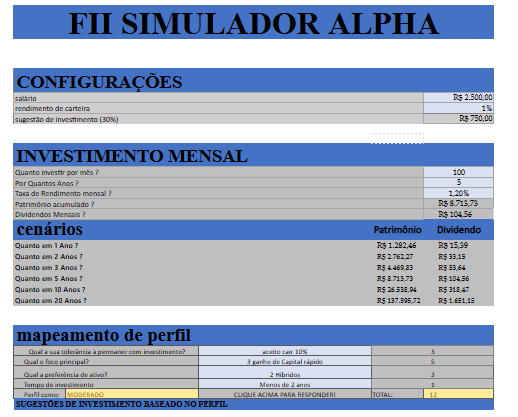

# projeto_excel_2026
# 📊 Simulador de Fundos Imobiliários (Excel)

 📌 Sobre o projeto
Este projeto é um simulador de Fundos Imobiliários desenvolvido em Excel com o objetivo de auxiliar investidores na análise de dividend yield, projeção de renda passiva e planejamento de aportes.

 🚀 Funcionalidades
- Cálculo automático de dividend yield
- Simulação de aportes mensais
- Projeção de renda passiva
- Interface simples em Excel

🛠️ Ferramentas utilizadas
- Microsoft Excel
- Fórmulas financeiras

 📈 Objetivo
Projeto desenvolvido para prática de análise financeira e construção de portfólio na área de mercado de capitais.

👨‍💻 Autor
Jonathan Silva dos Passos
## 📷 Preview da Planilha

